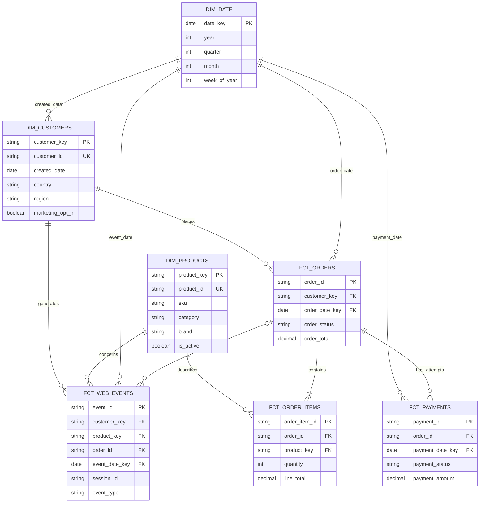
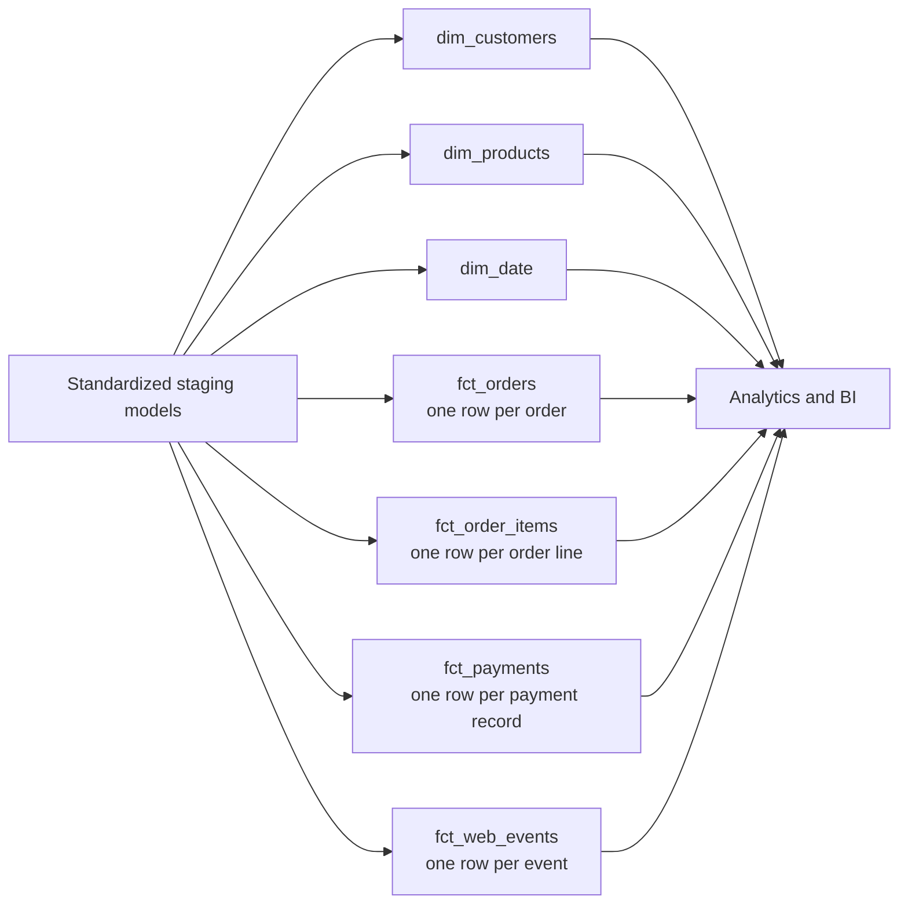

# Ecommerce Analytics Model

## Purpose and scope

This document proposes the analytics marts for the ecommerce demo domain. It defines an analytics contract and intended table grains; it does not prescribe dbt SQL. The marts consume cleaned, standardized staging models and retain source identifiers as degenerate dimensions where they are useful for drill-through.

Unless a metric explicitly says otherwise, monetary measures must be aggregated within a single currency. The demo data uses USD, but the model retains currency so a future multi-currency implementation cannot accidentally sum unlike amounts.

## Business questions

The warehouse should answer questions such as:

- How many orders are placed, completed, canceled, or otherwise unsuccessful over time?
- What are gross sales, discounts, shipping, tax, and order total by day, customer, country, and region?
- What is average order value, and how does it change by customer segment or acquisition period?
- Which products, categories, and brands drive units, merchandise revenue, and discounts?
- Which products are viewed frequently but purchased infrequently?
- How many customers are new, repeat, active, or opted in to marketing?
- What are customer lifetime order count and revenue?
- How many payment attempts succeed, fail, or are refunded, and what is the payment success rate by method?
- Do captured payments reconcile to order totals, and what value has been refunded?
- Which channels and devices generate sessions, product views, checkout activity, and attributed orders?
- What are session-to-order and product-view-to-purchase conversion rates?
- Where do customers drop out between browsing, checkout, payment, and completed purchase?

Metric definitions must state which order and payment statuses qualify. For example, booked demand may include placed orders while recognized ecommerce sales may exclude canceled orders and account for refunds.

## Proposed star schema

The design uses conformed dimensions shared by four facts. The facts intentionally have different grains; they should be aggregated to a compatible grain before being combined.

`order_id`, `session_id`, and `anonymous_id` are operational identifiers rather than separate dimensions in this initial model. They remain on facts for grouping, attribution, reconciliation, and drill-through. Customer, product, and order references on web events are optional because browsing can be anonymous or unrelated to a product or completed order.

## Dimension tables

### `dim_customers`

**Why it exists:** Provides one reusable, governed customer description for order and behavioral analysis. It prevents every report from repeatedly cleaning geography, identity, and consent fields.

**Grain:** One row per customer in the current-state demo design.

Important attributes include a warehouse `customer_key`, source `customer_id`, normalized email, name, account creation timestamp and date, country, standardized region, and marketing opt-in flag. Sensitive attributes such as email and names should be access-controlled in production.

The initial dimension is Type 1: changed attributes overwrite the current value. If historical reporting by geography or consent state becomes a requirement, it should become a Type 2 slowly changing dimension with effective timestamps and a current-row flag. Facts would then resolve the version effective at their event timestamp.

### `dim_products`

**Why it exists:** Supplies a consistent product hierarchy and descriptive context across item sales and web behavior, including products that have views but no sales or are no longer active.

**Grain:** One row per product in the current-state demo design.

Important attributes include `product_key`, source `product_id`, SKU, product name, standardized category, brand, current list price, currency, and active flag. Transactional selling price belongs in `fct_order_items`; using the dimension's current list price for historical revenue would be incorrect.

The initial design is Type 1. Product category or brand history can be implemented as Type 2 later if users need reports reflecting the classification effective when an event occurred.

### `dim_date`

**Why it exists:** Makes calendar logic consistent and supports complete time series, including dates with zero activity. It also avoids reimplementing week, month, quarter, weekend, and fiscal-calendar logic in every analysis.

**Grain:** One row per calendar date.

Important attributes include `date_key`, full date, day of week, day name, day of month, week of year, month number and name, quarter, year, weekend flag, and optional fiscal and holiday attributes. Its range should cover the earliest relevant source timestamp through a configurable future horizon.

## Fact tables

### `fct_orders`

**Why it exists:** This is the order-header fact for order lifecycle, customer purchasing, order economics, and average-order analysis. Keeping header-level amounts here avoids multiplying them when an order has several items.

**Grain:** Exactly one row per source order (`order_id`).

Key dimensions and identifiers are `customer_key`, `order_date_key`, and degenerate `order_id`. Descriptive fields include order timestamp, normalized order status, and currency. Measures include subtotal, order-level discount, shipping amount, tax amount, total amount, and an `order_count` indicator of 1. Derived status flags such as completed or canceled may be supplied when definitions are governed and tested.

### `fct_order_items`

**Why it exists:** This fact supports product-level units, merchandise value, discount, assortment, and basket analysis. An order header alone cannot explain which products produced its value.

**Grain:** Exactly one row per source order line (`order_item_id`), representing one product line within one order.

Key dimensions and identifiers are `product_key`, degenerate `order_id`, and `order_item_id`. The order date and customer can be reached through `fct_orders`; optionally denormalizing their keys onto this fact is acceptable for query performance only if reconciliation tests enforce consistency. Measures include quantity, unit selling price, line discount, and line total. Order-level shipping, tax, and header discounts must not be copied here without an explicit, documented allocation rule.

### `fct_payments`

**Why it exists:** Payments are attempts and financial events, not attributes of an order. A separate fact preserves multiple attempts, failures, successes, and refunds so payment performance and reconciliation remain accurate.

**Grain:** Exactly one row per source payment record (`payment_id`), which represents a payment attempt or payment/refund event associated with an order.

Key dimensions and identifiers are `payment_date_key`, degenerate `order_id`, `payment_id`, and provider transaction ID when present. Descriptive fields include payment timestamp, normalized payment method and status, and currency. Measures include payment amount and an attempt indicator of 1; governed conditional measures can include successful amount, failed attempt count, and refunded amount. A missing provider transaction ID on a failed attempt is valid and must not cause the record to be dropped.

### `fct_web_events`

**Why it exists:** This fact preserves the behavioral clickstream used for traffic, engagement, funnel, product-interest, and conversion analysis. It keeps anonymous activity and non-converting sessions visible.

**Grain:** Exactly one row per source web event (`event_id`).

Key dimensions and identifiers are optional `customer_key`, optional `product_key`, `event_date_key`, optional attributed `order_id`, plus degenerate `session_id`, `anonymous_id`, and `event_id`. Descriptive fields include event timestamp, standardized event type, channel, and device. The base additive measure is `event_count` = 1. Sessions, users, and conversions are distinct-count or derived metrics and therefore are not additive row measures.

## Relationships and safe joins

- `dim_customers` has one-to-many relationships to `fct_orders` and identified rows in `fct_web_events`. Anonymous web events use an unknown/anonymous customer key or a nullable key according to the eventual warehouse convention; either approach must preserve the event.
- `dim_products` has one-to-many relationships to `fct_order_items` and product-related rows in `fct_web_events`. Events without a product remain valid.
- `dim_date` has role-playing relationships through the date associated with each process: order date, payment date, event date, and customer-created date. Additional dates such as refund date can reuse the same dimension under a different alias.
- `fct_orders` has one-to-many relationships to `fct_order_items` and `fct_payments`. Joining all three directly can create a many-to-many fanout when an order has multiple lines and multiple payment records. Aggregate items and payments independently to `order_id` before joining them to orders.
- `fct_web_events.order_id` is an optional attribution link, not proof that every event caused an order. Funnel rules must define attribution windows and qualifying event types explicitly.
- Facts use conformed customer, product, and date keys so measures from separate business processes can be compared after aggregation to compatible dimensions and time grains.

## Important metrics

| Metric | Recommended definition |
| --- | --- |
| Orders | Count distinct `order_id`, filtered to explicitly stated qualifying statuses |
| Completed orders | Count of orders in the governed completed-status set |
| Cancellation rate | Canceled orders divided by placed orders |
| Gross merchandise value | Sum of pre-discount item value for qualifying orders; define whether this is `quantity * unit_price` or a supplied source subtotal |
| Net merchandise revenue | Sum of item line totals for qualifying orders, excluding shipping and tax |
| Order total | Sum of `fct_orders.total_amount` for qualifying orders, grouped by currency |
| Average order value | Qualifying order total divided by qualifying order count, grouped by currency |
| Units sold | Sum of item quantity for qualifying orders |
| Discount amount and rate | Sum of discounts; rate equals discount divided by pre-discount merchandise value |
| Customers purchasing | Distinct customers with at least one qualifying order |
| Repeat customer rate | Customers with at least two qualifying orders divided by purchasing customers for a defined cohort/window |
| Customer lifetime value | Cumulative qualifying revenue per customer; specify gross/net and refund treatment |
| Payment success rate | Successful payment attempts divided by all eligible payment attempts |
| Captured payment amount | Sum of successful/captured payment amounts, grouped by currency |
| Refunded amount | Sum of refund amounts using a documented sign convention |
| Payment reconciliation variance | Captured amount minus refunded amount minus the comparable qualifying order total |
| Web events | Count of event rows |
| Sessions | Count distinct `session_id` |
| Product views | Count of standardized product-view events |
| Session conversion rate | Sessions with an attributed qualifying order divided by eligible sessions |
| Product view-to-purchase rate | Viewed product/session combinations followed by a qualifying purchase divided by eligible viewed product/session combinations within a defined window |

Metrics that mix facts require care. For example, conversion should first summarize events at the session grain and orders at the attributed-session or customer/window grain; it should not count rows after directly joining event, item, and payment facts.

## Why dimensional modeling

Staging models are intentionally source-shaped: they clean values, cast types, and preserve recognizable source entities. Exposing only staging would push status rules, joins, deduplication, grain decisions, and safe aggregation into every dashboard. That produces inconsistent metrics and makes fanout errors likely.

Dimensional modeling was chosen because it:

- declares the grain and valid measures of each business process;
- provides conformed customer, product, and calendar context across processes;
- separates reusable descriptive attributes from measurable events;
- makes common BI queries understandable and performant;
- centralizes governed business rules while retaining drill-through identifiers;
- accommodates anonymous browsing, multiple payment attempts, and products without sales without flattening away detail; and
- creates stable analytics contracts even if raw source structures change.

The marts do not replace staging. Staging remains the auditable cleaning boundary; dimensions and facts form the curated business-facing layer on top of it.

## Future dbt materialization strategy

For the current small, static demo, tables or views may be simpler than incremental models. In a production implementation, materialization should follow data volume, arrival behavior, and correction requirements rather than the `fct_` prefix alone.

| Model | Recommendation | Rationale and production consideration |
| --- | --- | --- |
| `fct_web_events` | Incremental | Usually the highest-volume append-heavy stream. Use `event_id` as the unique key, a timestamp watermark with a lookback window for late events, and merge/upsert semantics for corrections. |
| `fct_order_items` | Incremental | Order-line volume grows continuously. Merge on `order_item_id` and reprocess a lookback or changed-order set so corrections are captured. |
| `fct_payments` | Incremental | Payment attempts and refunds arrive over time and may be updated asynchronously. Merge on `payment_id`; do not assume records are immutable solely because their event time is old. |
| `fct_orders` | Incremental | Orders change status and amounts after creation. Merge on `order_id` using a reliable source-updated timestamp or snapshot/change feed; a pure append strategy would leave stale lifecycle state. |
| `dim_customers` | Initially table; incremental at scale | The demo can rebuild it cheaply. At scale, merge changed customers by `customer_id`; if converted to Type 2, use dbt snapshots or equivalent effective-dated logic. |
| `dim_products` | Initially table; incremental at scale | Product cardinality is typically manageable. At scale, merge by `product_id`; use Type 2 only when historical attribute reporting is required. |
| `dim_date` | Table, not incremental | It is small, deterministic, and inexpensive to rebuild or generate for a configured date range. |

Every incremental fact needs uniqueness and not-null tests on its declared grain, relationship tests where optionality permits, an explicit late-arriving-data policy, and periodic full-refresh or reconciliation checks. Incremental filters should use ingestion or source-update timestamps when available; event timestamps alone are insufficient for reliably detecting late corrections.

## Assumptions and follow-up decisions

- The source identifiers are stable and unique within this ecommerce domain.
- Timestamps are standardized in staging, preferably to UTC; reporting timezone conversion is a separate governed choice.
- An unknown-member convention for unresolved dimension keys will be selected during physical implementation so facts are not silently discarded.
- Status sets, refund sign conventions, revenue recognition, attribution windows, and multi-currency conversion require explicit metric contracts before dashboards are built.
- Physical surrogate-key types, indexes, partitions, and dbt materializations are implementation decisions and are intentionally not defined as SQL here.
